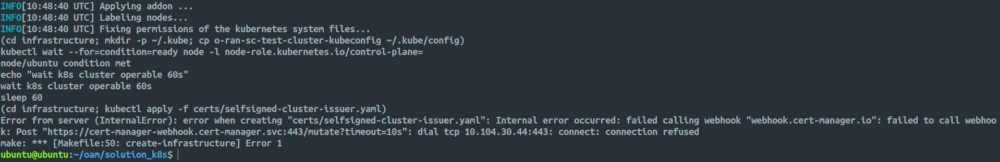
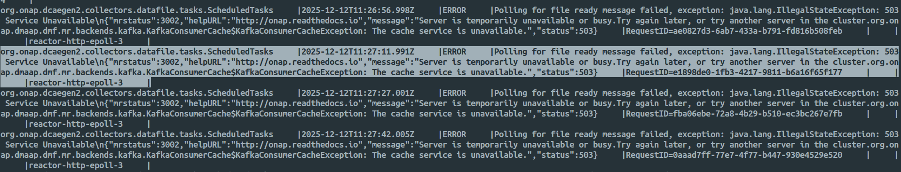
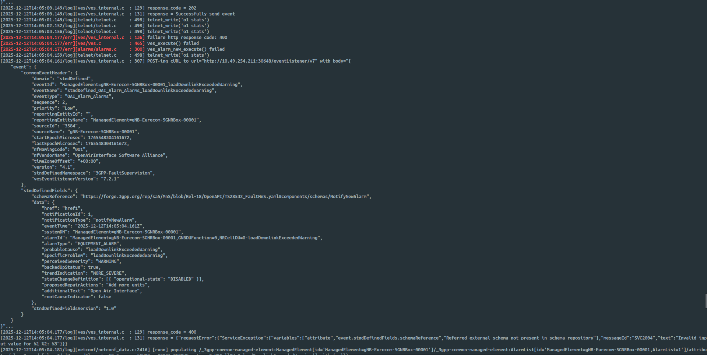

# O-RAN-SC OAM

## Introduction

This project deploys [O-RAN-SC (OSC) OAM](https://gerrit.o-ran-sc.org/r/admin/repos/oam) on a single-node Kubernetes cluster (kubeone). It includes a metric stack (InfluxDB and Grafana) to visualize performance data provided by 3GPP FTP files from network devices. Additionally, a test network function deployment is available to verify the function of NETCONF call-home and the O1 interface.


## Prerequisites

### Hardware Requirements

Ensure your machine meets the following specifications:

| Components  | Minimum Specifications | Recommended Specifications |
| :---------- | :--------------------- | :------------------------- |
| **OS**      | Ubuntu 22.04 LTS       | Ubuntu 22.04 LTS           |
| **CPU**     | 4 vCPU                 | 8 vCPU                     |
| **RAM**     | 20 GB                  | 32 GB                      |
| **Storage** | 50 GB HDD              | SSD with at least 50 GB    |

### Software Requirements

Install the `make` utility:

```bash
sudo apt update
sudo apt install make
```

### System Access

Passwordless sudo access is required for the installation scripts.

1.  Create a sudoers file for your user:

    ```bash
    sudo vim /etc/sudoers.d/20-kubeone-user
    ```

2.  Add the following line (replace `<youruser>` with your actual username):

    ```text
    <youruser> ALL=(ALL) NOPASSWD:ALL
    ```

## Installation Guide

### 1\. Initial Setup

Clone the repository and install the project prerequisites.

```bash
git clone "https://gerrit.o-ran-sc.org/r/oam"
cd oam/solution_k8s
make install-prereqisites
```

### 2\. Network and SSH Configuration

The deployment script requires specific network settings and a running SSH agent to communicate with the local node.

**Configure Deployment Variables**

Run the template preparation command. When prompted for IP addresses, press **Enter** to use your current Host IP for both Internal and External IPs.

```bash
make prepare-templates
```

**Configure Local DNS**

When asked for FQDN of the server, use the default `smo.o-ran-sc.org`. To resolve this locally, edit your hosts file:

```bash
sudo vim /etc/hosts
```

Add the following line:

```text
127.0.0.1 smo.o-ran-sc.org
```

Alternatively, if you prefer to use your current hostname formatted as an FQDN (e.g., `ubuntu.local`), ensure it is mapped in `/etc/hosts` if you encounter connection issues.

**Configure SSH Keys**

Kubeone requires SSH access to the node using an identity file.

```bash
# Generate a new SSH keypair if you do not have one (Press Enter for defaults)
ssh-keygen

# Start the SSH Agent
eval $(ssh-agent -s)

# Add the private key to the agent
ssh-add ~/.ssh/id_rsa

# Authorize the key locally
cat ~/.ssh/id_rsa.pub >> ~/.ssh/authorized_keys

# Verify SSH connectivity (this should not ask for a password)
ssh ubuntu@<your-host-ip>
```

### 3\. Kubernetes Infrastructure Deployment

Deploy the single-node Kubernetes cluster.

```bash
make create-infrastructure
```

**Verification**

If the script fails (e.g. see below image), ensure the node is ready and essential pods (such as cert-manager) are running. If they are not ready, run `make create-infrastructure` again after they are up.



```bash
kubectl get nodes
kubectl get pods -n cert-manager
```

### 4\. Configuration Overrides

It is necessary to override the default MariaDB image because older images have moved from the `bitnami` repository to `bitnamilegacy`.

Open the override configuration file:

```bash
vim application/override/onap-override-o-ran-sc-$ONAP_VERSION.yaml
```

Make the following changes:

1.  Add `mariadbImage: bitnamilegacy/mariadb:11.1.2` under the `global` section.
2.  Add `image: bitnamilegacy/mariadb:11.1.2` under the `mariadb-galera` section.

> [!NOTE]
> The default image tag is typically 10.5.8, but used 11.1.2 at the time of deployment.

### 5\. SMO Application Deployment

Deploy the SMO application stack, which includes ONAP components, SDNC, and MariaDB.

```bash
make deploy-smo
```

**Verification**

The deployment may take time as it pulls several large images. Open a separate terminal to monitor the status:

```bash
kubectl get pods -A
```

```bash
ubuntu@ubuntu:~/o1-adapter$ kubectl get pods -A
NAMESPACE          NAME                                                READY   STATUS      RESTARTS       AGE
cert-manager       cert-manager-5bd57786d4-vcdxb                       1/1     Running     0              3h32m
cert-manager       cert-manager-cainjector-57657d5754-94vl4            1/1     Running     0              3h32m
cert-manager       cert-manager-webhook-7d9f8748d4-j956r               1/1     Running     0              3h32m
ingress-nginx      ingress-nginx-admission-create-f8wnm                0/1     Completed   0              3h32m
ingress-nginx      ingress-nginx-admission-patch-crqqj                 0/1     Completed   3              3h32m
ingress-nginx      ingress-nginx-controller-65d6d978b-87kpg            1/1     Running     0              3h32m
kube-system        calico-kube-controllers-6b78c44475-v86sb            1/1     Running     0              3h32m
kube-system        canal-wvvb7                                         2/2     Running     0              3h32m
kube-system        coredns-5cd5577cc9-7gq6t                            1/1     Running     0              3h32m
kube-system        coredns-5cd5577cc9-tcr26                            1/1     Running     0              3h32m
kube-system        etcd-ubuntu                                         1/1     Running     0              3h33m
kube-system        kube-apiserver-ubuntu                               1/1     Running     0              3h33m
kube-system        kube-controller-manager-ubuntu                      1/1     Running     0              3h32m
kube-system        kube-proxy-x7brv                                    1/1     Running     0              3h32m
kube-system        kube-scheduler-ubuntu                               1/1     Running     0              3h33m
kube-system        metrics-server-74fbf9b9b4-xcd5j                     1/1     Running     0              3h32m
kube-system        node-local-dns-gf7t6                                1/1     Running     0              3h32m
mariadb-operator   mariadb-operator-844954c944-pnclh                   1/1     Running     0              3h25m
mariadb-operator   mariadb-operator-cert-controller-769886898b-fqxc2   1/1     Running     0              3h25m
mariadb-operator   mariadb-operator-webhook-6768b6799d-2sgxz           1/1     Running     0              3h25m
onap               mariadb-galera-0                                    1/1     Running     0              3h22m
onap               onap-chartmuseum-7bc565d46-jnt47                    1/1     Running     0              3h21m
onap               onap-dcae-datafile-collector-54fb56f757-ckfmf       1/1     Running     0              3h21m
onap               onap-dcae-ms-healthcheck-d7cf866bb-2ntqz            1/1     Running     0              3h21m
onap               onap-dcae-pm-mapper-9f5b6fc74-qggjd                 1/1     Running     0              3h21m
onap               onap-dcae-ves-collector-5f57dcb588-9f4d8            1/1     Running     0              3h21m
onap               onap-dcae-ves-mapper-5dcc6dd778-h2fr2               1/1     Running     0              3h21m
onap               onap-dmaap-dr-mariadb-init-config-job-vrrd7         0/1     Completed   0              3h21m
onap               onap-dmaap-dr-node-0                                1/1     Running     0              3h21m
onap               onap-dmaap-dr-prov-66bf788f8-8scnn                  1/1     Running     0              3h21m
onap               onap-message-router-0                               2/2     Running     0              111m
onap               onap-robot-5c748c57d9-5dp5m                         1/1     Running     0              3h21m
onap               onap-sdnc-0                                         1/1     Running     0              3h21m
onap               onap-sdnc-sdnrdb-init-job-p4bjt                     0/1     Completed   0              3h21m
onap               onap-sdnc-web-6cf9547dbd-hlqdd                      1/1     Running     0              3h21m
onap               onap-strimzi-entity-operator-5b46c475d4-ln8nb       2/2     Running     0              3h22m
onap               onap-strimzi-kafka-0                                1/1     Running     0              3h22m
onap               onap-strimzi-zookeeper-0                            1/1     Running     0              3h23m
strimzi-system     strimzi-cluster-operator-585f6fd995-dfts5           1/1     Running     2 (119m ago)   3h26m
```

> [!NOTE]
> Test cases may fail initially if the pods are not fully ready. Ensure all pods are in the `Running` or `Completed` state before proceeding.

**Verifying 5G Bulk PM Use Case**

Before running the functional test cases, you must verify the connectivity between the Datafile Collector (DFC) and the Message Router.

1.  **Check Datafile Collector Logs**

    Check the logs for the DFC pod to ensure it is receiving notifications:

    ```bash
    kubectl logs -n onap -l app=dcae-datafile-collector
    ```

2.  **Troubleshoot Message Router Connectivity**

    If the logs show an error indicating that DFC failed to receive notification events from the DMaaP Message Router (see image below), steps must be taken to restore connectivity.

    

    - **Fix:** Restart the Message Router pod:

      ```bash
      kubectl delete pod onap-message-router-0 -n onap
      ```

    - **Verify Fix:** After the pod restarts, check the DFC logs again. You should see a new error stating "Failed to download file". This is the expected behavior; it indicates that the DFC is now successfully communicating with the Message Router and attempting to fetch files.

3.  **Run the Test Script**

    Once connectivity is confirmed, run the 5G Bulk PM Use Case functionality test. This script spins up a temporary SFTP server to complete the test.

    ```bash
    ./application/patch_pmbulk.sh
    ```

**General Troubleshooting**

If the deployment fails or pods get stuck (e.g., `ImagePullBackOff` or `CreateContainerConfigError`), perform a clean cleanup before retrying. This ensures no stale Helm caches conflict with the new deployment.

1.  Undeploy the existing SMO deployment:

    ```bash
    make undeploy-smo
    ```

2.  Clear the Helm cache (required if you modified override files):

    ```bash
    rm -rf /home/ubuntu/.local/share/helm/plugins/deploy/cache
    ```

## Additional Components

### Metric Stack

You can deploy a metric stack to visualize PM data provided by network functions (CU, DU, RU) via O1 file-ready notifications. This stack includes:

- PM microservice (consumes 3GPP PM data from Kafka and writes to InfluxDB)
- InfluxDB
- Grafana

To deploy:

```bash
make deploy-metric
```

To remove:

```bash
make undeploy-metric
```

### Network Simulation

For verification purposes, two network functions can be deployed:

- **O-DU:** Connected via PNF Registration Request to the VES-Collector.
- **O-RU:** Connected via call-home to the Controller.

To deploy:

```bash
make deploy-test-nfs
```

To remove:

```bash
cd solution_k8s/tests/network-simulation/
./stop-network-simulation.sh
```

To get the deployment details, run:

```bash
make get-deploy-info
```

---

## Exposing VES Collector for OAI O1 Adapter

By default, the VES Collector service is configured as `ClusterIP`, which restricts network traffic to within the Kubernetes cluster. To allow an external OAI O1 Adapter (running on the host OS) to communicate with the collector, you must expose the service using `NodePort`.

> [!NOTE]
> Follow the [ngkore/OAI-O1-Adapter](https://github.com/ngkore/OAI-O1-Adapter) to deploy the O1 Adapter on your host machine.

**Step 1: Patch the Service**

Run the following command to change the service type from `ClusterIP` to `NodePort`. This exposes the service on a specific port on the Ubuntu VM's IP address.

```bash
kubectl patch svc dcae-ves-collector -n onap -p '{"spec": {"type": "NodePort"}}'
```

**Step 2: Retrieve the External Port**

Once configured as `NodePort`, Kubernetes assigns a random port in the _30000-32767_ range. Run the following command to identify it:

```bash
ubuntu@ubuntu:~/oam/solution_k8s$ kubectl get svc -n onap dcae-ves-collector
NAME                 TYPE       CLUSTER-IP      EXTERNAL-IP   PORT(S)          AGE
dcae-ves-collector   NodePort   10.103.167.13   <none>        8080:30648/TCP   140m
```

In this example, `30648` is the external port required to connect your OAI O1 Adapter.

The final VES URL for O1 Adapter will be:

```text
http://<HOST_IP>:<NODE_PORT>/eventListener/v7
```

### Troubleshooting: VES Collector Schema Validation

**Issue (on running the OAI O1 Adapter):**

The O1 Adapter connects to the VES collector successfully (indicated by a Code 202 response for `pnfRegistration`), but the Collector rejects specific file readiness notifications with an HTTP 400 error.



This occurs due to a 3GPP version mismatch:

1.  The OAI Adapter sends an event using the 3GPP Release 18 schema (`NotifyFileReady`).
2.  The ONAP VES Collector attempts to validate this against its internal library, which only supports schemas up to Release 16.
3.  The validation fails, resulting in the message rejection.

**Temporary Solution: Disable Schema Validation**

As we are trying in a lab environment, the most effective fix is to disable schema validation in the VES Collector. This forces the Collector to accept the JSON payload regardless of the schema version.

**Step 1: Edit the Configuration**

Edit the VES collector ConfigMap:

```bash
kubectl edit configmap -n onap onap-dcae-ves-collector-application-config-configmap
```

Locate the setting `collector.externalSchema.checkflag` within the configuration. Change the value from `1` (enabled) to `0` (disabled):

```yaml
collector.externalSchema.checkflag: 0
```

**Step 2: Apply Changes**

For the configuration change to take effect, restart the VES collector pod:

```bash
kubectl delete pod -n onap -l app=dcae-ves-collector
```

**Step 3: Retest**

Once the pod is back running, run the adapter script again to verify the fix:

```bash
./start-adapter.sh --adapter

# or
# sudo ./gnb-adapter
```
